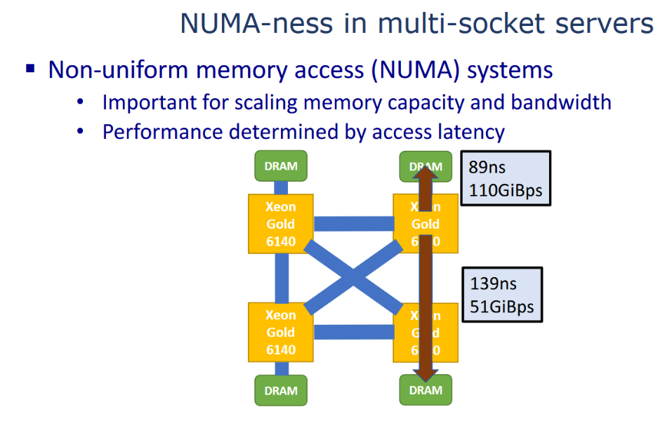

+++
title = "Questions and Thoughts on nuKSM"
[extra]
latex = true
bio = """
  [Benjamin Knutson] Currently pursuing a B.S. in Electrical and Computer engineering, Spends most of his time playing games, studying languages, and rushing to finish his homework
"""
[[extra.authors]]
name = "Eugene Cohen"
[[extra.authors]]
name = "Rabecka Moffit"
[[extra.authors]]
name = "Nanda Velugoti"
[[extra.authors]]
name = "David luo"
+++

## Introduction
Recently, our group reviewed a very interesting article titled “nuKSM:
NUMA-aware Memory De-duplication on Multi-socket Servers” by Akash Panda,
Ashish Panwar, and Arkaprava Basu.  This blog post focuses on nuKSM, a proposed
solution to Linux’s bad interaction with NUMA systems that deal with a lot of
data, such as servers. This past week we as a group collectively looked over
this paper and discussed it among ourselves, through this blog post I hope to
record some of our findings and questions.

## Overview
A quick table of notable terms:
NUMA-non uniform memory access
KSM-Kernel Same page Merging 
TPS-Transparent page sharing 
VM- Virtual machine

NUMA systems have special configurations of hardware called NUMA nodes, these are small collections of processors, memory, and I/O buses that are linked together in a NUMA architecture. 

## nuKSM’s purpose
nuKSM is meant to fix many of the problems KSM has been known to have over the
years, it accounts for priority when deciding which pages to delete, it changes
the way pages are structured to increase de-duplication speeds, and it makes
KSM work with NUMA in the first place.

## Discussion
Me and my classmates began the discussion listening to our presenter Eugene reading off a powerpoint included in the sources of this blog. After we finished reading the presentation together we began an open discussion dissecting the paper together. I would like to highlight a few interesting questions we had after reading, if any of these questions speaks to you please feel free to look more into it or reach out for further discussion. 
Could nuKSM have positive effects on GPU memory storage techniques?
I asked this question to Euguene due to reading the acronym CUP as GPU, even though it was a misunderstanding it led to an interesting tangent where we discussed if an implementation like nuKSM could benefit a piece of hardware like a graphics card. Both use memory and move large amounts of data around but they do it for different purposes and in different ways. We ended the discussion on that topic by noting that it might be beneficial for GPU developers to look at the techniques of nuKSM but it won’t be directly applicable to their work
How fast is good enough for deduplication?
One interesting thing noted in the paper is the redesign of the page reclamation algorithm. This algorithm is used to assign a since value for the priority of the specific process using a page.

This new algorithm is stated to increase fairness of priority, in addition the
page structure which used to follow a tree design was changed to a forest
design. This forest makes for faster page duplication so that more pages can be
deduplicated before new data comes in to overwhelm the system. The question
remaining is how big of a burst of data is required to cause a system failure.
nuKSM github mystery?

According to our presenter Eugene when he began researching this paper he found the nuKSM github page for the open source version of the project. The page is still intake and folder names are present however upon trying to download anything from the page you will find a lot of empty files and links. Since the project is only 4 years old and from the Indian Institute of Science you would think the resources would still be available. The kernel patch set is currently lost to time and unavailable, they do have their own benchmarks for the kernel but it is untestable. This is even more strange when you consider that most universities require papers and their respective materials to be preserved in databases like ACM.

Are duplicate pages acceptable?

A small discussion took place involving the point that the original graphs
presented in the paper did not take into account the possibility of duplicate
pages, i.e. the practice of not deleting either page and leaving a copy with
both VM’s. This is a scenario that would only occur in rare cases where the
priority rate is split evenly between some number of VM’s by nearly equal
amounts. The argument was that it would be more computationally cost effective
to just sacrifice some memory to save a lot of time accessing a different place
in memory, this is especially true if we consider nuKSM’s implementation of
forested pages where the data we have to fetch is deep inside the page. 

## Final Thoughts
nuKSM makes two important changes to vanilla KSM, it makes NUMA aware, and it
changes the way it creates and manages pages. While this implementation does
increase productivity and fix issues for NUMA systems using linux there are
still many more chances for growth, there is a recently published paper
discussing adaptive memory deduplication linked below that might be the next
step in this line of thought. This paper in fact references nuKSM trying to
harmonize cache access with page access counters in a way similar to the page
relocation algorithm. 

## Sources
- https://apanwariisc.github.io/publications/pact-2021-nuksm/nuksm-pact21-slides.pdf
- https://github.com/csl-iisc/nuKSM-pact21-artifact
- https://ieeexplore.ieee.org/document/10466365
- nuKSM: NUMA-aware Memory De-duplication on Multi-socket Servers
- Akash Panda*, Ashish Panwar, Arkaprava Basu
