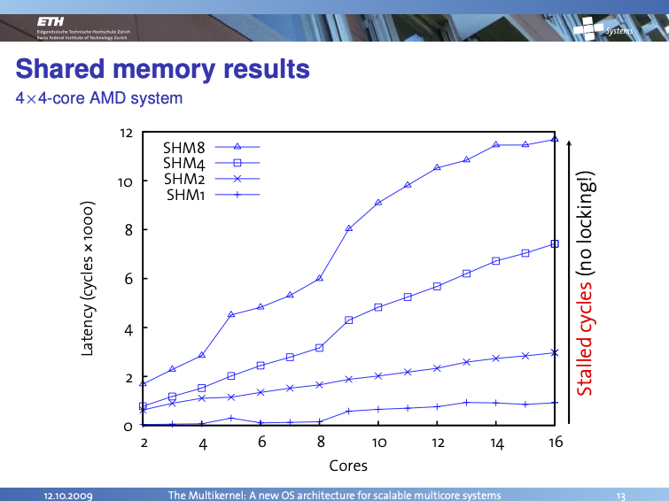
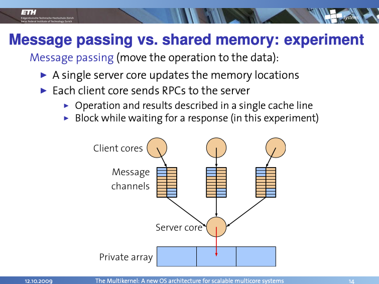
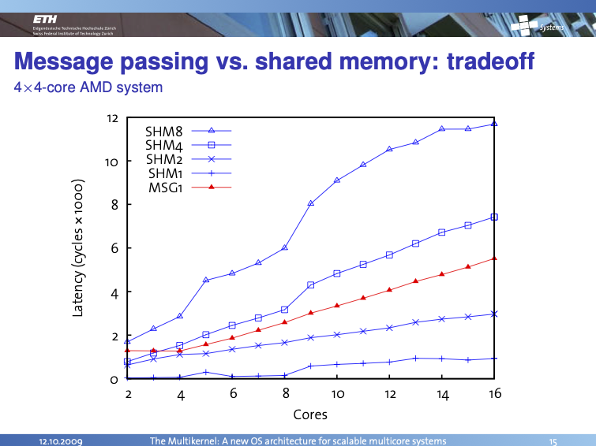
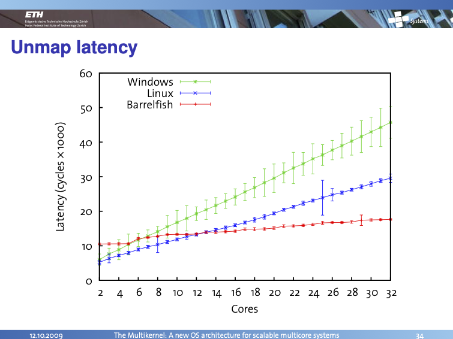
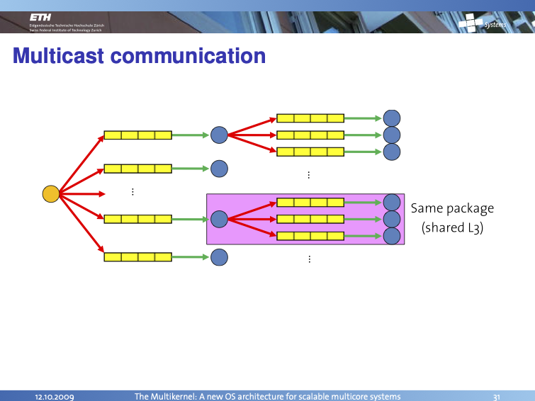
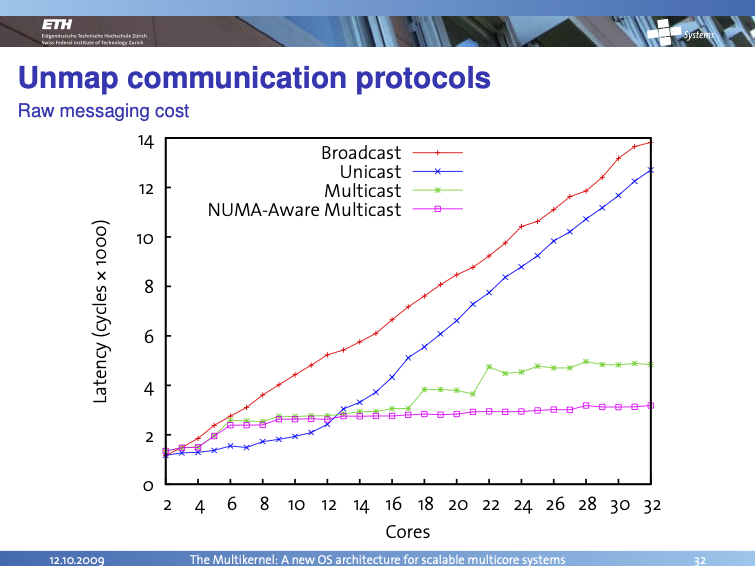

+++
title = "The Multikernel: Ambitious OS Architecture Ahead of Its Time"
[extra]
[[extra.authors]]
name = "Rabecka Moffit (leader)"
[[extra.authors]]
name = "David Luo (scribe)"
[[extra.authors]]
name = "Eugene Cohen (blogger)"
[[extra.authors]]
name = "Nanda Velugoti"
[[extra.authors]]
name = "Benjamin Knutson"
+++

## Introduction
This paper describes a different paradigm for constructing an OS relying on message-passing instead of shared memory for organizing OS data structures across multiple cores.  Mainstream operating system kernels predominantly make use of shared memory data structures - global information used for the core OS, device drivers or major subsystems that use some form of mutual exclusion to protect access.  This paper presents an alternative approach: data structures are not shared but instead cross-core message-based communication was used instead.

The paper makes a case for the diversity of hardware architectures making it increasingly difficult for an OS to adapt to these differences.  Some of these claims have not aged particularly well from 2009 as seen from today as great improvements have been made in describing to OSes hardware differences so it can adapt - but the core concepts in the paper are still relevant today.

## The Shared Memory Scaling Problem

The architecture of the rack/board/socket/die/core hierarchy and the corresponding interconnect+cache topology can have a profound impact on the performance of the OS and applications.  The shared kernel data structure approach is exposed to these performance effects as we see from the shared memory RPC benchmarks which show latency increasing as number of cores increase but also as the size of the messages increase (from 1-8 cachelines):

## Message-Passing to the Rescue?

The solution used in the Multikernel paper and implemented in the Barrelfish OS passes messages instead, so rather than the kernel data structures being inherently shared, instead messages are sent to request that one responsible entity carry out the requested action:

and an interesting result occurs, showing improved scaling for core count and message sizes versus shared memory:

The graph above is from a 4-socket AMD server platform circa 2009.  These X86 systems have cache coherency protocols active but the effects are only observed in the RPC implementation itself as the Barrelfish OS does not share other data.

The authors present a comparison of a TLB shootdown (Unmap) flow across Windows, Linux and Barrelfish, the first two using shared memory kernel data structures:

## RPC Shared Memory Optimization

Interestingly, even though the paper set out to define a "no shared data" OS architecture to enable it to be immune to hardware interconnect and cache coherency implementation differences, the practical effects of the RPC system on the X86 server hardware showed that RPC performance was directly impacted by the hardware implementation.  Specifically, the shared data (RPC message buffer) data flows from the sender to the receiver had a performance impact requiring the RPC layer to be adapted:

We see that this optimization has a profound impact as the number of cores increases:

Which perhaps goes to show that as long as any shared memory is involved that NUMA is ready to bite you.

Given that the experimental setup still used shared memory for RPC itself and we know the hardware implementation has a measurable impact on performance, it would be interesting to consider using modern (2025) hardware to repeat some of these experiments including RPC mechanisms that did not rely on shared memory at all.

## Final Thoughts

Think about the kind of experiments we could set up today to explore the tradeoffs between shared memory and message-passing approaches.  What effects would we see running across more diverse topologies including multiple dies in a package ranging to multiple servers across racks?  Could adjusting interconnect and cache coherency policies fundamentally change the performance characteristics of operating system data sharing?  Is there some hardware assist that would be optimal for OS message passing?  Would an adaptive algorithm that chooses the best of both shared memory and message passing be feasible?

## Sources
- https://www.sigops.org/s/conferences/sosp/2009/papers/baumann-sosp09.pdf
- https://www.sigops.org/s/conferences/sosp/2009/slides/baumann-slides-sosp09.pdf
- https://www.youtube.com/watch?v=fZt1LILFyXY
- https://barrelfish.org/
- https://github.com/BarrelfishOS/barrelfish

