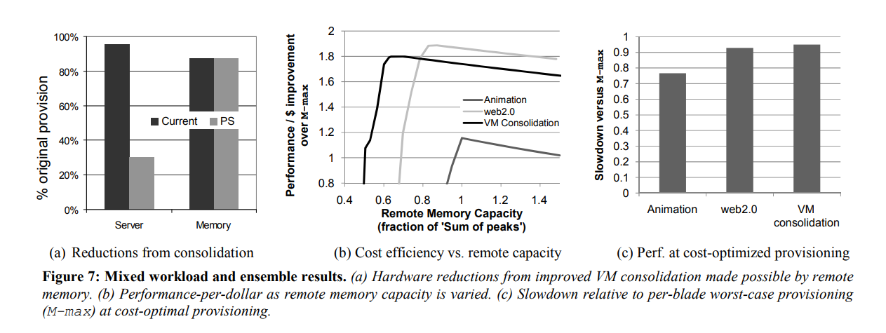

+++
title = "Disaggregated Memory for Expansion and Sharing in Blade Servers"
[extra]
bio = """ 
  Gabriel Rodgers is an Electrical and Computer Engineering student at Oregon State University that enjoys creating low-level embedded projects and growing carnivorous plants.
"""
[[extra.authors]]
name = "Gabriel Rodgers (leader)"
[[extra.authors]]
name = "Sami Aljabery (blogger)"
[[extra.authors]]
name = "Noah Bean (scribe)"
+++

## Introduction

This paper remarks on the current trend in server architecture, there’s an imbalance in the memory-to-capacity ratio, which is accompanied by an increase in power consumption and data center costs. The paper re-evaluates this relationship by looking at the traditional compute-memory co-location and implementing something new called a “memory blade”, a module for blade servers that enables disaggregated memory across a system. This inclusion is used for memory-capacity expansion, resulting in an increase in performance and reducing power costs. The memory blades in particular are building blocks that allow for two system proposals. The two system proposals are the page-swapping remote memory (PS) and fine-grained remote memory access (FGRA). PS is implemented in the virtual layer while FGRA is implemented in the coherence hardware to handle transparent memory expansion and sharing across systems.

## Implementation

The implementation starts with the memory blade, which is composed of DRAM modules that connect to the server via a high-speed interface such as PCIe. Furthermore, the design of the memory blade includes custom hardware to allow for both PS and FGRA systems to be implemented in testing. For PS, it doesn’t use the custom hardware but leverages virtual memory to handle page swaps in both local and remote memory. The hypervisor in the software stack manages the page access, ensuring that the system works with the OS and applications. Unlike PS, FGRA doesn’t rely on just software and the VMM. FGRA takes full advantage of the custom hardware the memory blade utilizes to enable use of coherence protocols and a custom memory controller. These implementations result in a reduced overhead of page-swapping. Both these systems are put through trace-based simulations and evaluated on benchmarks to compare the performance of a memory-blade system to a traditional system.

## Results

The results contain simulations using benchmarks such as zeusmp, perl, gcc, bwaves, spec4p, nutch4p, tpchmix, mcf, pgbench, indexer, specjbb, and Hmean. Figure 5 details the capacity expansion results, and we find that PS has better performance over FGRA in speedups over M-app-75% provisioning and M-median provisioning. These graphs highlight both FGRA and PS relative to the baseline, with a 4X to 320X increase in performance. In figure 7a, PS handles the imbalance between VM memory demands and local capacity, resulting in a possible 68% reduction of processor count. In terms of cost, PS is slightly better as it's not reliant on custom hardware, but implementing disaggregated memory improves performance-per-dollar by 87% in Figure 7(b). FGRA has some drawbacks as it doesn’t handle swapping like PS, which is addressed inn figure 8 for potential hardware implementations such as page migration.

## Weakness

One of the main weaknesses discussed in the paper is that the memory blade introduces several modes of failure, which could be solved by adding redundancy to the memory controller. Another noted weakness is that PS works without any additional hardware use, but FRGA would require some hardware modifications to be feasible, and this would include addressing page migration. Adding on, both PS and FRGA struggle with heavier loads, which could be addressed by modifying the high-speed interface. This is also a concern when considering local and remote latency tradeoffs, an upgrade from PCIe to CXL could be worth visiting.

## Class Discussion

-   **Hypervisor Type:** The paper likely assumes a Type 1 hypervisor (runs directly on hardware), but a Type 2 hypervisor (runs on an OS) could work with adjustments. The type matters for implementation details but not the core concept.
    
-   **4KB Page Transfers:** Waiting for a 4KB transfer may seem slow, but locality and caching reduce the impact. Prefetching could further help, though its effectiveness depends on the workload.
    
-   **Workload Locality:** The paper’s workloads (from 2009) may not reflect modern graph workloads with random access patterns. However, improved CPU prefetchers since then could lessen performance penalties.
    
-   **CXL (Compute Express Link):** A modern evolution of PCIe, CXL supports coherence natively, potentially simplifying FGRA-like approaches without custom coherence filters.
    
-   **Modern Trends:** Today, page-based remote memory access often uses InfiniBand or Ethernet (not just PCIe), enabling memory sharing across datacenters.
    

## Practical Considerations

-   **Increasing Local DRAM:** Adding more DRAM to each server is wasteful, as it’s underutilized most of the time.
    
-   **Interleaving Memory Blades:** Compute blades can pull pages from memory blades as needed. This is slower than local memory but faster than accessing a hard disk drive (HDD).
    
-   **Dynamic Allocation:** No software changes are required unless dynamically reallocating memory within the blade.
    
-   **Performance Differences:** PS vs. FGRA differences arise from transfer granularity (4KB pages vs. 64-byte cache blocks) and interconnect speed (PCIe vs. HyperTransport).
 
  
  

## Source:

[https://dl.acm.org/doi/10.1145/1555754.1555789](https://dl.acm.org/doi/10.1145/1555754.1555789)

[https://chatgpt.com/](https://chatgpt.com/)

Note: ChatGPT was used to improve clarity on the class discussion section.
