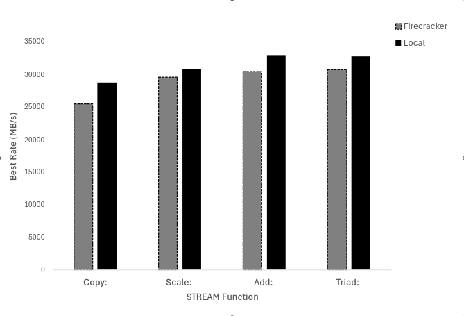
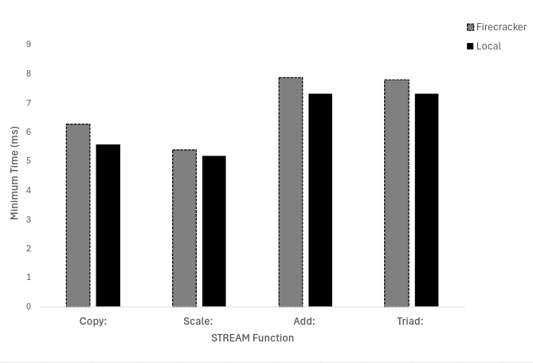
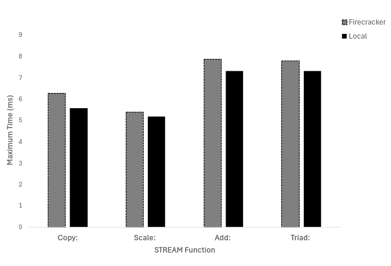

+++
title = "Exploring Disaggregated Memory Performance with Firecracker VMM"
[[extra.authors]]
name = "Gabriel Rodgers (leader)"
[[extra.authors]]
name = "Sami Aljabery (blogger)"
[[extra.authors]]
name = "Noah Bean (scribe)"
+++


  

## Introduction  
This project aims to test and compare aggregated and disaggregated memory performance when using Firecracker VMM to run virtual machines. This topic was of interest to the group because as programs get larger and memory becomes the bottleneck, disaggregated memory will become more common. Firecracker is a popular tool at the moment because of its ability to rapidly deploy Micro Virtual Machines (VMMs). Our research sought to combine the fields of disaggregated memory and Virtual Machines (VM). However, due to time and skill constraints, the project became more limited in scope. The new aim of the project was to compare the memory performance of benchmarks in a local machine versus in a Firecracker VMM to facilitate a discussion between the benefits and drawbacks of virtual machines. We expected that the local machine would have better memory performance than Firecracker because there are more overheads. We will also provide a proposal for how to attempt to implement disaggregated memory in Firecracker for exploring this topic more.  


## Implementation  
The implementation for this project started with the standard version of Firecracker, which will be the base case for this project. Firecracker was built onto a local machine using the file provided on GitHub [here](https://github.com/firecracker-microvm/firecracker). The local machine used to run the Firecracker VMM is a **Lenovo LOQ 15APH8 laptop** that contains:  
- **16 GiB of memory**  
- **1.5 TB disk capacity**  
- **AMD Ryzen 7 7840HS with Radeon 780M graphics**  
- **Nvidia GeForce RTX 4050 Laptop GPU**  
- **Ubuntu 24.04.02 LTS (64-bit)**, which is compatible with Firecracker's requirements.  

The common setup of Firecracker requires Docker and Bash. We started with a basic `config.json` provided on the Firecracker GitHub. Due to technical issues with KVM access, we used a configured file alongside a given bin (`hello-vmlinux.bin`) and rootfs (`hello-rootfs.ext4`). These two files represent the kernel image and the root filesystem image, both essential for launching Firecracker.  

In the `my_vm_config.json` file, these files were configured. Other configurations specified:  
- **vCPU count:** 2  
- **Memory size:** 512 MiB  

To launch Firecracker, we used the following command:  
```bash  
sudo firecracker --no-seccomp --config-file my_vm_config.json  
```  

Once running, we gathered system specifications:  
- **CPU:** Two AMD Epyc processors with two cores each.  
- **OS:** Alpine Linux 3.8, running on Kernel 4.14.55-84.37.amzn2.x86_64.  
- **Memory:** 501.8 MB (501852 KB).  

The next step was to mount the STREAM benchmark executable. The VM retrieves data from a virtual disk, which serves as an init file containing necessary information to start a VM. 
We decided to use the benchmark STREAM because it is a simple benchmark that measures sustainable main memory bandwidth in MB/s and the corresponding computation rate for simple vector kernels. Once the VM config file structure contained the compiled file, the benchmark was able to be run within the virtual machine and test the memory bandwidth. It’s important to note that for the benchmark to work on the firecracker VMM, it needed to be statically compiled. For better results, we also ran the benchmark on the local machine that ran Firecracker. The benchmark program was obtained [here](https://www.cs.virginia.edu/stream/).  


## Results  
Using the STREAM benchmark, we ran 5 trials on each system to understand performance trends. The benchmark evaluates memory bandwidth and computation across four functions:  
- **Copy**: Measures memory read and write.  
- **Scale**: Measures how memory bandwidth handles arithmetic operations.  
- **Add**: Measures multi-source memory bandwidth.  
- **Triad**: Measures a mixture of memory patterns and computation.  

These assess data transfer performance, computational efficiency, parallel memory workloads, and overall memory performance. Figure 1 goes over “Best rate (MB/s)”, Figure 2 goes over “Average time (ms)”, Figure 3 goes over “minimum time (ms)”, and Figure 4 goes over “maximum time (ms)”. In the trials, we found that the local machine performed better than the firecracker VMM. In the figures below, we see that the local machine takes less time and has a higher rate of MB/s.

### Figures:   

Figure 1: STREAM’s evaluation of Best Rate (MB/s) on both Firecracker and Local Machine.  
  
Figure 2: STREAM’s evaluation of Average Time (ms) on both Firecracker and Local Machine.    

Figure 3: STREAM’s evaluation of Minimum Time (ms) on both Firecracker and Local Machine.    

Figure 4: STREAM’s evaluation of Maximum Time (ms) on both Firecracker and Local Machine.   

Taking the average of all four functions of STREAM, we found:  
- Best Rate (MB/s): STREAM has 7.2% less bandwidth on Firecracker compared to the local machine.  
- Average Time (s): STREAM is 6.9% slower on Firecracker than on the local machine on average.  
- Minimum Time (s): STREAM's minimum time benchmark is 7.8% slower on Firecracker than the local machine.  
- Maximum Time (s): Firecracker is 9.7% slower than the local machine.  


## Issues
We had many challenges over the course of this project which started with finding a machine to run linux. Originally our team wanted to use an Oregon State University (OSU) owned machine but there were many regulations with this machine. All programs or downloads had to be added through OSU’s Information Technology (IT) department so this had week turn around times between a program request and the implementation. For security reasons, OSU IT would not download Docker which made Firecracker unusable. At this point, our team had to pivot from using an OSU owned machine to a personal machine that has a Linux Operating System (OS) because this is the only allowed OS for Firecracker. 

Our next challenge was to get a custom file structure for the VM setup with the compiled benchmark files using Docker. We did not need to use Docker even though the documentation says that Docker is required. This was an issue we were able to overcome.

Implementing disaggregated memory was difficult as it required creating virtual nodes that would simulate the pooled memory. With the switch to a personal computer, the process became difficult to set up, and unfortunately left out of the testing. Another issue was that Firecracker is written in Rust but none of the project members have any prior experience with Rust. An incorrect assumption our team made was that Rust would be an approachable language that we would have the time and resources to learn. This was not the case and posed a more significant challenge than we had anticipated. 

## Next Steps  
Our proposal for implementing disaggregated memory support in Firecracker involves modifying several memory-related files in the Firecracker VMM kernel. These files are shown in the following directory map of Firecracker, where bold-italic files are those that should be modified to support disaggregated memory:  

```
firecracker
├── CHANGELOG.md
├── CHARTER.md
├── CODE_OF_CONDUCT.md
├── CONTRIBUTING.md
├── CREDITS.md
├── Cargo.lock
├── Cargo.toml
├── DEPRECATED.md
├── FAQ.md
├── LICENSE
├── MAINTAINERS.md
├── NOTICE
├── PGP-KEY.asc
├── README.md
├── SECURITY.md
├── SPECIFICATION.md
├── THIRD-PARTY
├── deny.toml
├── docs
├── pre-commit
├── resources
│   ├── chroot.sh
│   ├── guest_configs
│   ├── overlay
│   ├── rebuild.sh
│   └── seccomp
│       ├── ***aarch64-unknown-linux-musl.json***
│       ├── unimplemented.json
│       └── ***x86_64-unknown-linux-musl.json***
├── rusty-hook.toml
├── src
│   ├── acpi-tables
│   ├── clippy-tracing
│   ├── cpu-template-helper
│   ├── firecracker
│   ├── jailer
│   ├── log-instrument
│   ├── log-instrument-macros
│   ├── rebase-snap
│   ├── seccompiler
│   ├── snapshot-editor
│   ├── utils
│   └── vmm
│       ├── Cargo.toml
│       ├── benches
│       ├── src
│       │   ├── acpi
│       │   ├── arch
│       │   ├── builder.rs
│       │   ├── cpu_config
│       │   ├── device_manager
│       │   │   ├── acpi.rs
│       │   │   ├── legacy.rs
│       │   │   ├── ***mmio.rs***
│       │   │   ├── mod.rs
│       │   │   ├── ***persist.rs***
│       │   │   └── ***resources.rs***
│       │   ├── devices
│       │   ├── dumbo
│       │   ├── gdb
│       │   ├── io_uring
│       │   ├── lib.rs
│       │   ├── logger
│       │   ├── mmds
│       │   ├── persist.rs
│       │   ├── rate_limiter
│       │   ├── resources.rs
│       │   ├── rpc_interface.rs
│       │   ├── seccomp.rs
│       │   ├── signal_handler.rs
│       │   ├── snapshot
│       │   ├── test_utils
│       │   ├── utils
│       │   ├── vmm_config
│       │   └── vstate
│       │       ├── ***kvm.rs***
│       │       ├── ***memory.rs***
│       │       ├── mod.rs
│       │       ├── vcpu
│       │       └── vm
│       └── tests
├── tests
└── tools
```

Purposes of each file and why they would need to be modified to support disaggregated memory  
- firecracker/resources/seccomp/x86_64-unknown-linux-musl.json
- firecracker/resources/seccomp/aarch64-unknown-linux-musl.json 
  - These files contain the syscall handlers used for x86_64 and aarch64 architectures. Disaggregated-related syscalls would be different from regular local memory syscalls (when using RDMA), so that is why we believe these files would need to be modified to support those different syscalls (depending on architecture of course). This of course depends on the disaggregated memory implementation in the kernel - but if new syscalls were created to support disaggregated memory in the kernel, then these files would need to be modified to support those added syscalls. Note that with CXL disaggregated memory these files would remain the same, as CXL uses the same syscalls as regular local memory. 


- firecracker/src/vmm/src/arch/x86_64/layout.rs
- firecracker/src/vmm/src/arch/aarch64/layout.rs
   - These files contain the address maps of x86_64 and aarch64 architectures. They do not support disaggregated memory in these address maps. For CXL disaggregated memory support, we propose adding CXL memory mappings (start and size) into these files. For RDMA disaggregated memory support, we propose adding locally pinned RDMA memory into these files.  

The above files are what we would change to support disaggregated memory in Firecracker. For RDMA, the number of files needed to be modified would likely be larger than the subset that we highlight due to the fact that memory accesses via RDMA would need completely different interfaces than the regular POSIX-compliant syscalls used for local memory accesses. For CXL, the number of files needed to be modified would also likely be larger than the subset we highlight due to needing to use different names for CXL memory rather than local memory to prevent performance hits. It would be beneficial in that case to have distinct labels for local memory and CXL memory, where CXL memory would be used when local memory is low. This would require changes in files that use memory as well as the `layout.rs` files that we highlighted. The layout and syscall json files that we mention are likely just a starting point to get disaggregated memory supported in Firecracker. 

Once the above files, and possibly others, are modified we would use firecracker to launch a virtual machine that supported disaggregated memory. Since we did not have an available system that supports disaggregated memory, we had planned to utilize server space through CloudLab. One server would support the Firecracker kernel with some memory to approximate a computer and another server would contain entirely memory to approximate a remote memory bank. The test would involve running memory benchmarks with the programs entirely contained in the first server versus with programs having spread their memory between the two servers. Ultimately, tests where entire programs won’t fit in the memory available on the first server would give a better idea of the performance of disaggregated memory because the program has to use this structure rather than arbitrarily using this structure. The benchmarks that we had picked were Parsec, NAS Parallel Benchmark, Graph500, Intel Memory Latency Checker, and STREAM.

---
## Conclusion  
This project went through several iterations before completion. The goal of the first version of this project was to modify the Firecracker VMM source code to provide disaggregated memory support and use performance benchmarks to test this version on CloudLab machines - comparing local aggregated memory performance to disaggregated memory performance. This version was far too ambitious for a single term, so the project’s scope was decreased. This second version of the project aimed to test performance benchmarks running in Firecracker VMM and natively and to provide a short proposal on how to support disaggregated memory in Firecracker VMM. We used the STREAM benchmark to test performance differences between these two options because of the relative ease of compilation of STREAM, and we successfully showed that Firecracker has a small hit (around 10%) to performance when compared to native performance. Our proposal states that for disaggregated memory support, the layout.rs files would need to be modified for CXL (and locally-pinned RDMA memory) disaggregated memory support. It also requires that the syscall json files would need to be modified to support RDMA syscalls. Lastly, our proposal states that more files would need to be changed to support switching between disaggregated memory and local memory for optimal performance.  

### Key Findings:  
- Firecracker incurs a small (~10%) performance hit compared to native execution.  
- Modifications required for disaggregated memory:  
  - Modify `layout.rs` files for CXL/RDMA memory support.  
  - Modify syscall JSON files for RDMA syscalls.  
  - Optimize memory allocation to distinguish between local and disaggregated memory.  

---  

## References  
- [AMD STREAM Benchmark](https://www.amd.com/en/developer/zen-software-studio/applications/spack/stream-benchmark.html)  
- [Firecracker Documentation](https://firecracker-microvm.github.io/)  
- [Firecracker GitHub](https://github.com/firecracker-microvm/firecracker)  
- [Firecracker Kernel Setup](https://github.com/firecracker-microvm/firecracker/blob/main/docs/rootfs-and-kernel-setup.md)  
